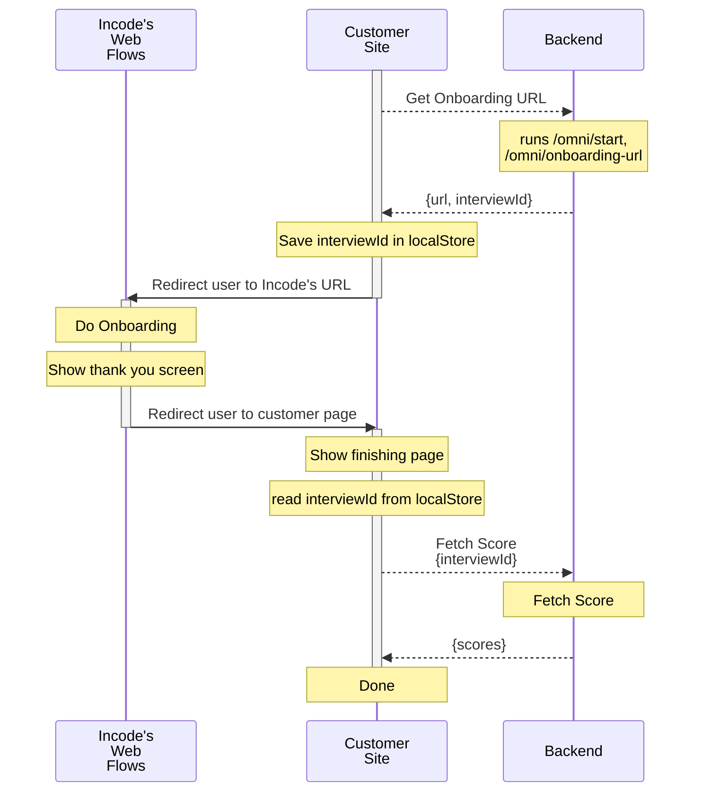

# Sample Redirect and Back
This app showcase how to create a low code app that will fetch the
url of the onboarding and redirect the user to that page, then come
back using the redirectionURL property of the workflow to fetch
the score.

The full steps between the customer site, incode's hosted flows,  and backend can be seen in this diagram.




# Backend Server
A backend server that will generate the url is needed for this sample,
luckily for you we already have sample server for PHP, NodeJS, Python,
PHP and Java and .NET, please reffer to our documentation on subject:
[Quick Start Sample Server](https://developer.incode.com/docs/quick-start-servers)

In order to simplfy development, this repo is configured to reverse
proxy a local backend server (`http://localhost:3000`) in the `/api`
url like `https://<your-ip>:5173/api`, if you want to point your
frontend development to a backend server deployed elsewhere, change
the VITE_TOKEN_SERVER_URL to the full url of such server.

# Install
First install all the required packages
```
npm install
```

# Configure
Copy `.env.example` as `.env` and configure it to point to a remote
server, or leave it as /api to point to the reverse proxied server
running in your local machine

```
VITE_TOKEN_SERVER_URL=/api
```

# Development
This repo is configured so run it in development by executing
```
npm run dev
```

You will get a hot reloading environment that exposes the page in
localhost and in the ip of the machine in case you want to try it
in your cellphone.
