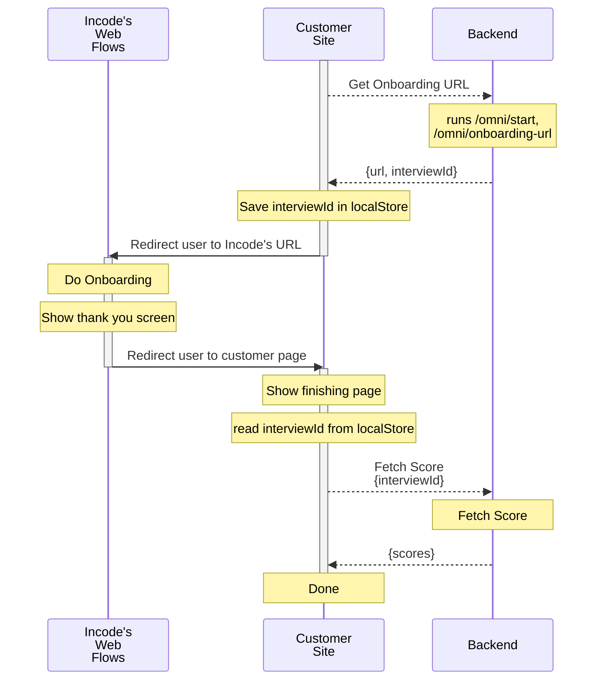

# Sample Redirect and Back
This app showcase how to create a low code app that will fetch the
url of the onboarding and redirect the user to that page, then come
back using the redirectionURL property of the workflow to fetch
the score.

The full steps between the customer site, incode's hosted flows,  and backend can be seen in this diagram.




# Fake Backend Server
Starting the session, getting the url and fetching the scores must be
done in the backend, to simplify development this sample includes a
fake_backend.js file that does this in the frontend.

Please be advised to replace this with a proper backend for your
production runs.

The APIKEY should never be exposed in the frontend.

# Install
First install all the required packages
```
npm install
```

# Configure
Copy `.env.example` as `.env` and configure it with the values of your flow

```
# HERE ONLY FOR DEMO PURPOSES, THE APIKEY AND THE FLOW_ID SHOULD NEVER BE IN THE FRONTEND.
VITE_FAKE_BACKEND_APIURL=https://demo-api.incodesmile.com
VITE_FAKE_BACKEND_APIKEY=
VITE_FAKE_BACKEND_FLOWID=
```

# Development
This repo is configured so run it in development by executing
```
npm run dev
```

You will get a hot reloading environment that exposes the page in
localhost and in the ip of the machine in case you want to try it
in your cellphone.

## Author

© Incode Technologies Inc. All rights reserved.